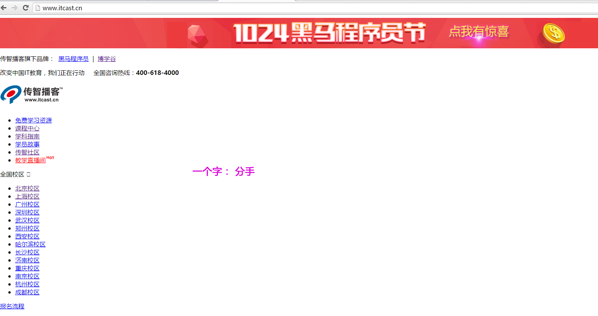

## 一、CSS初识

CSS(Cascading Style Sheets)通常称为CSS样式表或层叠样式表（级联样式表），主要用于设置HTML页面中的文本内容（字体、大小、对齐方式等）、图片的外形（宽高、边框样式、边距等）以及版面的布局等外观显示样式。

CSS以HTML为基础，提供了丰富的功能，如字体、颜色、背景的控制及整体排版等，而且还可以针对不同的浏览器设置不同的样式。

**CSS的发展历程**

从HTML被发明开始，样式就以各种形式存在。不同的浏览器结合它们各自的样式语言为用户提供页面效果的控制。最初的HTML只包含很少的显示属性。
随着HTML的成长，为了满足页面设计者的要求，HTML添加了很多显示功能。但是随着这些功能的增加，HTML变的越来越杂乱，而且HTML页面也越来越臃肿，于是CSS便诞生了。

## 二、CSS-网页的美容师

CSS的出现，拯救了混乱的HTML，当让更加拯救了我们web开发者。 让我们的网页更加丰富多彩。   

CSS的最大贡献就是：  让 HTML 从样式中解脱苦海，  实现了 HTML 专注去做 结构呈现。 而样式交给 CSS 后，你完全可以放心的早点洗洗睡了！

而且，CSS 做的很出色，如果JavaScript是网页的魔法师，那么CSS它是我们网页的美容师，不信，你看:

> 有人说， 没有不漂亮的女人，只有不会打扮的女人。
>
> 我想说， 没有不好看的网页，只有不会CSS的前端。

### 2.1 网页添加 CSS和不添加CSS 的对比

**带有CSS的页面：**

**没有CSS的页面：**

## 三、CSS样式规则

使用HTML时，需要遵从一定的规范。CSS亦如此，要想熟练地使用CSS对网页进行修饰，首先需要了解CSS样式规则，具体格式如下：                                          

在上面的样式规则中:

1. 选择器用于指定CSS样式作用的HTML对象，花括号内是对该对象设置的具体样式。
2. 属性和属性值以“键值对”的形式出现。
3. 属性是对指定的对象设置的样式属性，例如字体大小、文本颜色等。
4. 属性和属性值之间用英文“:”连接。
5. 多个“键值对”之间用英文“;”进行区分。
6. 可以用段落和表格的对齐的演示。

